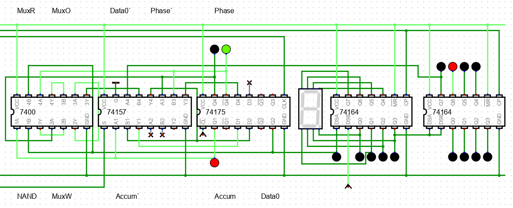
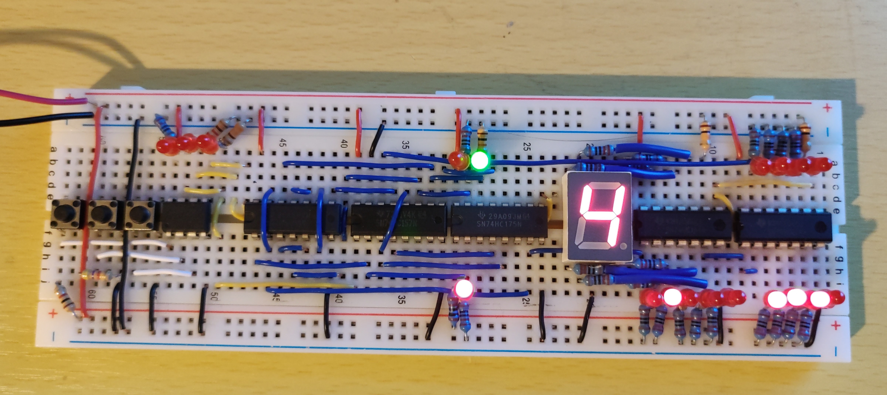

# SpinGate

SpinGate is a [1 bit computer](https://en.wikipedia.org/wiki/1-bit_computing) with a corresponding single bit [1-instruction language](https://en.wikipedia.org/wiki/One-instruction_set_computer) intended to be implemented in hardware with the minimum number of logic gates.  It has only a single 1-bit instruction - 0 or 1

# Demo

[Interactive Demo](https://jacoblister.github.io/spingate/)

# SpinGate Machine and Instruction

A SpinGate machines consists of
* data register (a shift register)
* accumulator bit
* phase bit (load, store)
* NAND gate

The instruction is as follows

| Instruction | Description                                         |
|-------------|-----------------------------------------------------|
|0            | rotate shift register                               |
|1            | when load - accum <= bit0, phase <= store           |
|             | when store - bit0 <= bit0 NAND accum, phase <= load |

# I/O

SpinGate does not support I/O, however, the begining of a program can be used to set the state of the data register, and the data register can be considered as output at the completion of a program

# Hardware Implementation

SpinGate has been implmented in hardware using only 7400 series logic chips, see Digital simulation:





# JavaScript Implementation
A SpinGate machine can be implemented in JavaScript as follows:

```
let cpuData = 0
let cpuBits = 4
let cpuIndex = 0
let cpuStore = false
let cpuAccum = 0

function spin() {
    cpuData = cpuData << 1 | (cpuData >> (cpuBits - 1))
}

function gate() {
    if (cpuStore) {
        cpuData = (cpuData & -2) | !(cpuAccum & (cpuData & 1))
    } else {
        cpuAccum = cpuData & 1
    }
    cpuStore = !cpuStore
}
```

# Assembly Language

libspingate is a JavaScript library for constructing SpinGate programs.

## Init 

declare a SpinGate machine, and set its register size and inital state

```
init("0000")
```

## Prog

register a SpinGate program

*prog(name, code)*

```
prog("spin", "0")
prog("gate", "1")
prog("spin back", "000")
prog("toggle", "111")
prog("nop", "1111")
```

## Bit

define a bit position in the data register, with a label

*bit(index, label)*

```
logic0 = bit(0, "0")
regA = bit(1, "A")
regB = bit(2, "B")
out = bit(3, "R")
```

## Nand

Perform a NAND operation on two bits:

*nand(src, dst)*

```
prog("Clear A", nand(logic0, regA))
```

Internally, *nand()* keeps track of the shift register position and uses the register size defined by *init()* to rotate bit indexes into place.  It is therefore defined as a builtin function, to simplify maintaining programs if the register size is changed.

# Composing Programs

Further operations can be composed by defining new functions using the *nand()* gate function as a building block

## Bit Operations

```
toggle = (reg) => nand(reg, reg)
clear = (reg) => nand(reg, logic0)
set = (reg) => nand(reg, logic0) + toggle(reg)
copy = (src, dst) => nand(logic0, dst) + nand(src, dst)
swap = (src, dst) => copy(dst, tmp0) + copy(src, dst) + copy(tmp0, dst)
```

## Logic Gates

```
and = (dst, src) => nand(dst, src) + toggle(dst)
or = (dst, src) => toggle(dst) + toggle(src) + nand(dst, src) + toggle(src)
nor = (dst, src) => or(dst, src) + toggle(dst)
```

